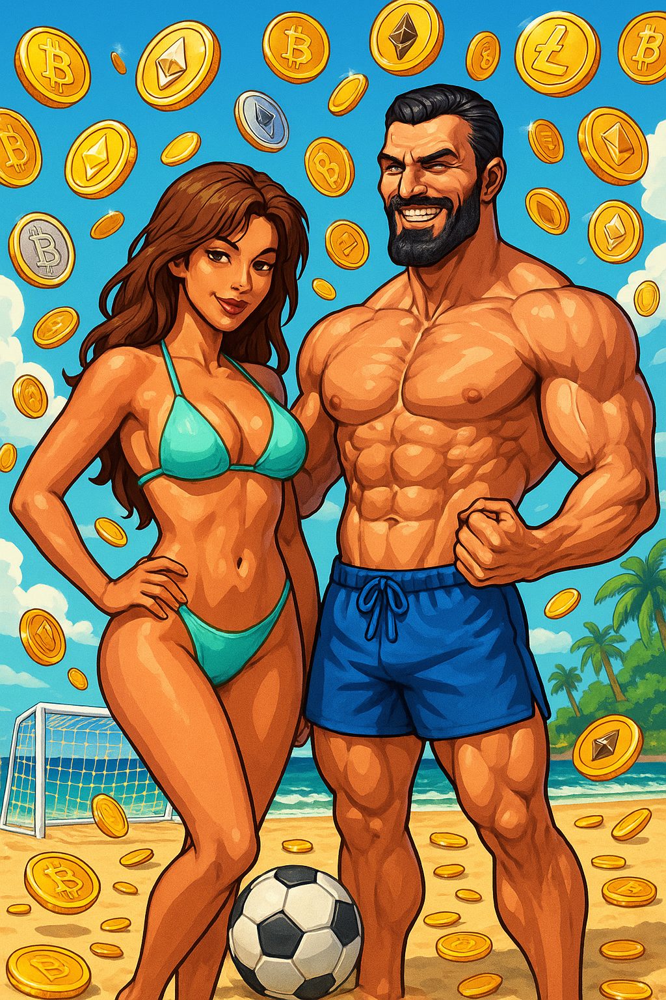

# 🏝️ Crypto Beach Soccer 🏝️



## 🎮 Overview

Crypto Beach Soccer is a fun, web-based 3D soccer game that combines blockchain culture with beach sports! Control characters with oversized cryptocurrency coin heads as they kick a meme-inspired ball around a vibrant beach setting.

Built with Three.js for 3D visuals and Cannon.js for physics, this game offers an entertaining mix of casual gameplay with crypto-themed abilities that add strategic depth to the matches.

## 🚀 Features

- **Unique Crypto Characters**: Choose from Bitcoin, Ethereum, Dogecoin, or PepeCoin
- **Special Abilities**: Each character has unique powers based on their crypto identity
- **Beach Environment**: Play on a vibrant beach field complete with palm trees and sand
- **Physics-Based Gameplay**: Realistic ball movement and character interactions
- **Responsive Design**: Play on desktop or mobile devices
- **Single Player**: Challenge the AI in fast-paced 3-minute matches
- **Multiple Control Schemes**: Keyboard controls for desktop, touch controls for mobile

## 🎬 Installation & Setup

### Prerequisites
- Node.js (v16+)
- npm or yarn

### Installation Steps

1. **Clone the repository**
```bash
git clone https://github.com/your-username/crypto-beach-soccer.git
cd crypto-beach-soccer
```

2. **Install dependencies for both client and server**
```bash
# Install client dependencies
cd client
npm install
cd ..

# Install server dependencies
cd server
npm install
cd ..
```

3. **Start the development server**
```bash
# Start client
cd client
npm run dev

# In a separate terminal, start server
cd server
npm run dev
```

4. **Open your browser and navigate to:**
```
http://localhost:5173
```

## 🕹️ Game Manual

### Controls

#### Desktop Controls:
- **Movement**: WASD keys or Arrow keys
- **Jump**: SHIFT key
- **Kick**: SPACEBAR
- **Ability**: E key
- **Restart**: R key

#### Mobile Controls:
- **Movement**: On-screen directional buttons
- **Jump**: Jump button
- **Kick**: Kick button
- **Ability**: Special ability button

### Characters

1. **Bitcoin (BTC)** 
   - **Ability: HODL - The Diamond Hands Upgrade**
   - Dramatically increases kick power (150%) and ball control radius
   - Duration: 7 seconds

2. **Ethereum (ETH)**
   - **Ability: Smart Contract - Gas Fee Turbocharger**
   - Massively enhances jump height (150%) and provides a 50% speed boost
   - Duration: 7 seconds

3. **Dogecoin (DOGE)**
   - **Ability: To The Moon - Lunar Gravity Edition**
   - Grants temporary invincibility, 120% speed boost, and enhanced kicking
   - Duration: 5 seconds

4. **PepeCoin (PEPE)**
   - **Ability: Meme Magic - The Rare Pepe Power**
   - Enhances ALL abilities by 80% for the ultimate crypto champion experience
   - Duration: 6 seconds

### Game Rules

1. Matches last 3 minutes - player with most goals wins
2. Special abilities recharge after cooldown (15 seconds)
3. Power-ups appear on the field periodically (15-30 seconds)
4. Press R to reset the ball if it gets stuck
5. Stay within the field boundaries to maintain control

### Strategy Tips

1. **Power-up Collection**: Crypto abilities appear on the field as glowing coins - collect them for temporary boosts
2. **Ability Timing**: Save your special abilities for critical scoring or defensive moments
3. **Ball Control**: Position yourself properly before kicking to aim accurately
4. **Field Positioning**: Don't stray too far from the center, maintain good field coverage
5. **Jump Shots**: Use jump kicks for higher trajectories to clear opponent blocks

## 🛠️ Technical Architecture

Crypto Beach Soccer is built with:
- **Three.js** - 3D rendering and animations
- **Cannon.js** - Physics engine for realistic ball movement
- **React** - UI components and game structure
- **Zustand** - State management
- **TypeScript** - Type-safe code
- **WebSocket** - For future multiplayer implementation

## 📝 License

This project is licensed under the MIT License - see the LICENSE file for details.

## ✨ Acknowledgements

- Crypto community for inspiration
- Three.js community for resources
- All contributors and playtesters

---

Made with 💖 and code | © 2025 Crypto Beach Soccer Team